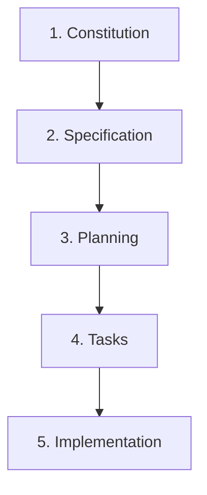

# 🌱 SpecKit Assistant

> **Visual Orchestrator for Spec-Driven Development (SDD)** — Decoupled Hexagonal Architecture, Next.js 15, ReactFlow, and Multi-Agent Orchestration.

---

[](https://opensource.org/licenses/MIT)
[](https://github.com/dmux/speckit-assistant)
[](https://nodejs.org)
[](https://nextjs.org)
[](#contributing)

---

### 🌐 Project Overview

**SpecKit Assistant** is a visual orchestrator for **Spec-Driven Development (SDD)**. It connects your local specification, planning, and task checklists with AI agents (Claude, Gemini, Copilot) through a modern, Vercel-style dashboard. By utilizing **Hexagonal Architecture**, it fully decouples the core domain rules from UI and external runners, ensuring that your local file system remains the single source of truth at all times.

---

## 📖 Table of Contents

1. [Core Concept & SDD Flow](#-core-concept--sdd-flow)
2. [Key Features](#-key-features)
3. [User Interface Screenshots](#-user-interface-screenshots)
4. [Architecture (Hexagonal / Ports & Adapters)](#-architecture-hexagonal--ports--adapters)
5. [Installation & Setup](#-installation--setup)
6. [How to Publish to npmjs](#-how-to-publish-to-npmjs)
7. [CLI Usage](#-cli-usage)
8. [Workspace Anatomy](#-workspace-anatomy)
9. [Testing & Quality Assurance](#-testing--quality-assurance)
10. [License](#-license)

---

## 🎯 Core Concept & SDD Flow

**Spec-Driven Development (SDD)** is a software engineering methodology that uses structured markdown documents to guide AI agents and human developers sequentially through software lifecycle stages:



1. **Constitution**: Establish project-wide principles, tech stack, and constraints.
2. **Specification**: Document user requirements and features in detail.
3. **Planning**: Outline technical implementation decisions and file modifications.
4. **Tasks**: Break down plans into an actionable checklist of developer-ready tasks.
5. **Implementation**: Execute tasks and generate clean code.

SpecKit Assistant acts as the **Visual Dashboard** and **Command-Line Interface** to run, approve, and track these phases, syncing seamlessly with your local file system.

---

## ✨ Key Features

* 🎨 **Premium UI/UX**: High-fidelity dark and light themes styled with a sleek, minimalist Vercel aesthetic.
* 🗺️ **Interactive ReactFlow DAG Map**: Visualizes the dependencies and status of every feature's development lifecycle.
* 📋 **Drag-and-Drop Kanban Board**: Progress features forward (auto-approving intermediate steps and launching agents) or roll them back (marking downstream files as stale) by simple drag-and-drop.
* 🤖 **Agnostic Agent Dispatcher**: Spawn executions via terminal subshells for Anthropic's **Claude CLI**, Google's **Gemini CLI**, **GitHub Copilot CLI**, or custom CLI wrappers.
* 📝 **WYSIWYG Markdown Editor**: Edit specifications or plans with a formatting toolbar (Bold, Italic, Headings, Code Blocks, Tables, Checklists), with support for alternating-row Vercel-style tables.
* 🔄 **Conflict & Change Guard**: A live watcher (`chokidar` + SSE) detects external changes on disk and alerts you in case of editing conflicts.
* 💾 **Persistent State**: Automatically remembers your active workspace inside `~/.speckit-assistant-config.json`.

---

## 🖥️ User Interface Screenshots

### Kanban Board View (Interactive state progression)


### ReactFlow DAG Map View (Feature dependency tracking)


---

## 🏛️ Architecture (Hexagonal / Ports & Adapters)

To prevent coupling our core workflows to UI libraries, Next.js, or file system APIs, SpecKit Assistant is built using **Hexagonal Architecture**.

```text
src/
├── domain/                    # Core business rules
│   ├── models/                # Types (Feature, Phase, Task)
│   └── ports/                 # Ports (Interfaces)
│       ├── in/                # Inbound use cases (GetWorkflowState, RunPhase)
│       └── out/               # Outbound SPIs (WorkspaceRepository, AgentRunner)
├── adapters/                  # Infrastructure implementations
│   ├── primary/               # Next.js API controllers, React/ReactFlow UI
│   └── secondary/             # File system sync, Process spawners
```

For a detailed analysis of our architectural decisions, read our **Architecture Decision Records (ADRs)**:

* [ADR 001: Hexagonal Architecture (Ports and Adapters)](docs/adr-001-hexagonal-architecture.md)
* [ADR 002: State Synchronization and Agent Dispatch](docs/adr-002-state-sync-and-agent-dispatch.md)

---

## ⚙️ Installation & Setup

### Prerequisites

* **Node.js**: `v18.0.0` or higher
* **Package Manager**: `pnpm` (preferred), `npm` or `yarn`

### 🚀 Running Instantly via `npx`

You don't need to install or clone anything locally to run the assistant. Simply run it inside your target workspace using `npx`:

```bash
npx speckit-assistant
```
*(This will download the latest release, start the server on port `18080`, and open the Web UI in your browser.)*

### 🛠️ Local Development Quick Start

If you wish to modify the code or contribute to the project:

```bash
# Clone the repository
git clone https://github.com/dmux/speckit-assistant.git
cd speckit-assistant

# Install dependencies using pnpm
pnpm install

# Compile the CLI and Next.js assets
pnpm run build

# Start the Web UI on the default port (18080)
pnpm start
```

---

## 📦 How to Publish to npmjs

To publish `speckit-assistant` under your own account/organization on npm so it can be run via `npx`:

### 1. Authenticate with npm
Log in to your npm registry account (sign up at [npmjs.com](https://www.npmjs.com) if you haven't already):
```bash
npm login
```

### 2. Verify and Configure the Package Name
Open [package.json](file:///Users/guru/work/dmux/speckit-assistant/package.json) and verify:
- `"name"`: Change this if the package name `speckit-assistant` is already taken, or if you want to publish under a scoped organization (e.g. `"@my-org/speckit-assistant"`).
- `"version"`: Bump the version number (e.g. `"0.1.1"`, `"1.0.0"`) every time you publish new changes.

### 3. Build & Publish
Run the publish command. The configured `prepublishOnly` script will automatically compile the Next.js assets and TypeScript files before bundling and uploading the package:

```bash
# For public packages
npm publish

# If using a scoped package (e.g. @my-org/speckit-assistant)
npm publish --access public
```

---

## 💻 CLI Usage

SpecKit Assistant comes with a powerful CLI. When installed globally, you can invoke it using `speckit-assistant` (or via local path `./bin/bin/cli.js`).

### CLI Commands

* **Start the Web Server**:

    ```bash
    speckit-assistant
    ```

    Starts the Next.js server on port `18080` (avoids conflicts on Unix/Windows/macOS) and auto-opens `http://localhost:18080` in your default browser.

* **Check Workflow Status**:

    ```bash
    speckit-assistant status [-w <workspace-path>]
    ```

    Displays a terminal-based overview of your Constitution and feature phase statuses.

* **Approve a Phase**:

    ```bash
    speckit-assistant approve <phase> [feature-name]
    ```

    Marks a phase (e.g. `specification`, `planning`, `tasks`) as approved.

* **Discard/Reset a Phase**:

    ```bash
    speckit-assistant discard <phase> [feature-name]
    ```

    Resets the phase and marks all downstream phases as stale (e.g. discarding `specification` marks `planning`, `tasks`, and `implementation` as stale).

* **Create a New Feature**:

    ```bash
    speckit-assistant create <feature-name>
    ```

    Generates a new directory under `specs/<feature-name>` with template markdown files.

* **Run an Agent Phase**:

    ```bash
    speckit-assistant run <phase> [feature-name] --agent <claude|gemini|copilot> --prompt "refinement details"
    ```

### Command Options

* `-w, --workspace <path>`: Specify the target workspace directory. Defaults to the current directory, but persists the last-used workspace in `~/.speckit-assistant-config.json`.
* `-p, --port <number>`: Override the default port `18080` for the Web UI.
* `--agent <type>`: AI agent execution binary (default: `claude`).
* `--prompt <text>`: Feed specific refinements or custom instructions to the AI agent.

---

## 📂 Workspace Anatomy

SpecKit Assistant manages markdown files inside your target project workspace. Your workspace directory structure should follow this pattern:

```text
my-project/
├── .specify/
│   ├── memory/
│   │   └── constitution.md     # Project-wide context & rules
│   └── .runtime/
│       └── workflow-state.json # Internal workflow cache (automatically managed)
└── specs/
    ├── 001-user-authentication/
    │   ├── spec.md             # Feature requirements
    │   ├── plan.md             # Implementation strategy
    │   └── tasks.md            # Actionable checklists
    └── 002-database-migration/
        ├── spec.md
        ├── plan.md
        └── tasks.md
```

---

## 🧪 Testing & Quality Assurance

SpecKit Assistant maintains a high bar for reliability and code health:

* **Vitest** for fast, concurrent unit and integration testing.
* **100% Mocked File Systems** in unit tests to prevent disk pollution.
* **Isolated temporary workspaces** for E2E tests, avoiding workspace write conflicts.

We boast **99.44% statement coverage** across our domain rules, API routers, process dispatchers, and repository adapters:

```bash
# Run unit and integration tests
pnpm run test
```

### Coverage Report Details

```text
 ✓ src/domain/services/WorkflowService.test.ts (9 tests)
 ✓ src/adapters/secondary/fs/FSWorkspaceRepository.test.ts (2 tests)
 ✓ src/app/api/api.test.ts (9 tests)

 Test Files  3 passed (3)
      Tests  20 passed (20)
   Duration  511ms
```

---

## 📄 License

This project is licensed under the MIT License. See [LICENSE](LICENSE) for details.
